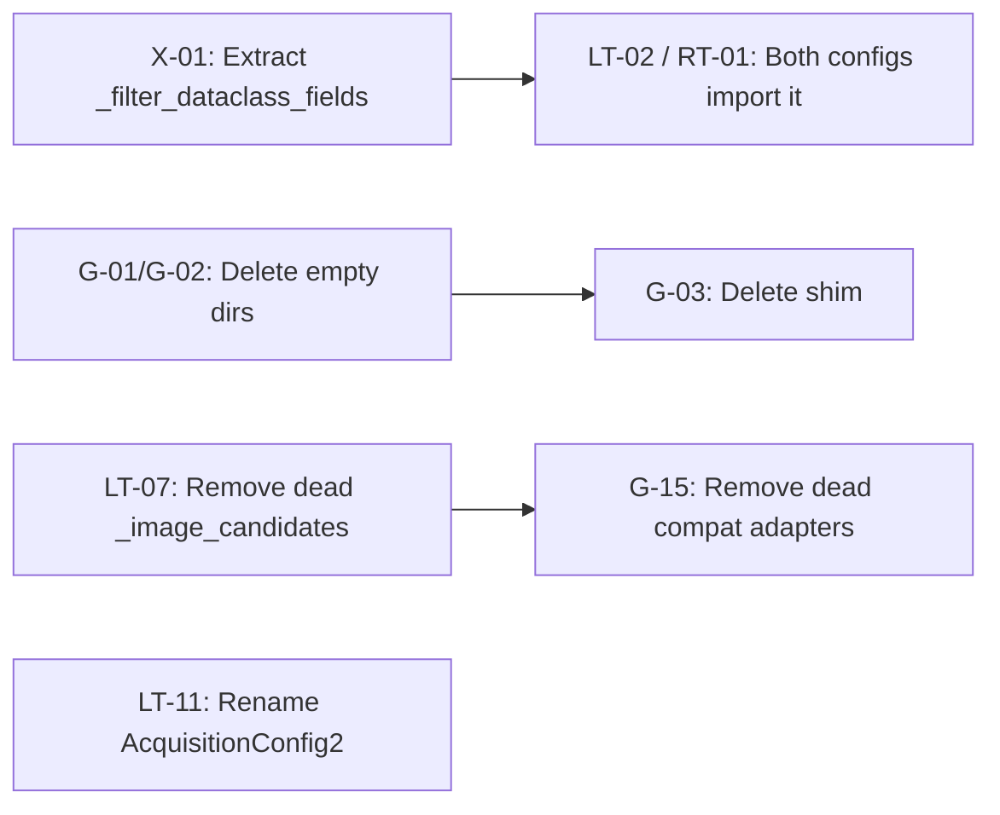
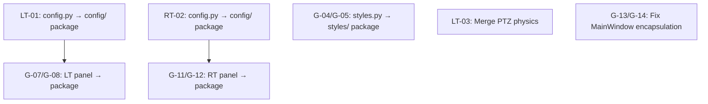

# Production-Grade Refactoring & Code Cleanup Plan

**Scope**: GUI module · Local Terminal module · Remote Terminal module
**Date**: 2026-09-19
**Status**: Draft — Ready for Review

---

## Table of Contents

1. [Executive Summary](#1-executive-summary)
2. [Current Architecture Snapshot](#2-current-architecture-snapshot)
3. [GUI Module Refactoring](#3-gui-module-refactoring)
4. [Local Terminal Module Refactoring](#4-local-terminal-module-refactoring)
5. [Remote Terminal Module Refactoring](#5-remote-terminal-module-refactoring)
6. [Cross-Cutting Concerns](#6-cross-cutting-concerns)
7. [Migration Strategy & Execution Order](#7-migration-strategy--execution-order)
8. [Risk Assessment](#8-risk-assessment)

---

## 1. Executive Summary

The Coarse Alignment Simulator is a functioning PyQt5 application with well-separated module boundaries (`gui/`, `local_terminal/`, `remote_terminal/`), but several areas of structural debt have accumulated that impair maintainability, testability, and onboarding velocity. This plan identifies **41 concrete refactoring items** across three priority tiers, preserving all existing behaviour while moving toward a production-grade folder structure and code quality bar.

### Key Themes

| Theme | Examples |
|---|---|
| **God-object files** | `local_terminal/terminal.py` (837 lines), `local_terminal/config.py` (1125 lines), `local_terminal/system.py` (1047 lines), `gui/panels/local_terminal_panel.py` (1059 lines), `gui/styles.py` (654 lines) |
| **Duplicated utilities** | `_filter_dataclass_fields()` is copy-pasted across `local_terminal/config.py` and `remote_terminal/config.py` |
| **Leaky abstractions** | `MainWindow.on_timer()` reaches into `controller._last_snapshot` (private attr), `windows._settings` (private attr) |
| **Compatibility shims** | `gui/environment_panel.py` exists solely as a re-export shim; `session.camera_config` is an alias for `local_terminal_config` |
| **Inline styling** | `remote_terminal_panel.py` and `local_terminal_panel.py` embed raw CSS strings instead of referencing `styles.py` |
| **Bloated `__init__.py`** | `local_terminal/__init__.py` re-exports 40+ symbols; every new class requires a manual addition |

---

## 2. Current Architecture Snapshot

### 2.1 Directory Map (Focus Modules)

```
gui/
├── __init__.py              (re-export shim)
├── app.py                   (re-export shim)
├── environment_panel.py     (backwards-compat shim → panels/)
├── main_window.py           (342 lines — composition root)
├── styles.py                (654 lines — monolithic QSS)
├── application/
│   ├── commands.py           (intent dataclass)
│   ├── controller.py         (168 lines — lifecycle + stepping)
│   ├── session.py            (259 lines — sim ownership)
│   └── state.py              (enums)
├── core/
│   ├── button_animator.py    (global click animation filter)
│   ├── frame_presenter.py    (NumPy→QPixmap)
│   ├── renderer.py           (FOV + minimap overlay, 14K)
│   └── window_manager.py     (secondary window lifecycle)
├── panels/
│   ├── base.py               (shared widget helpers)
│   ├── disturbances_panel.py (51K — very large)
│   ├── environment_panel.py
│   ├── global_panel.py
│   ├── local_terminal_panel.py  (57K — very large)
│   └── remote_terminal_panel.py (40K — very large)
├── presentation/
│   ├── simulation_presenter.py
│   └── view_state.py
├── views/
│   ├── control_view.py
│   ├── dashboard_view.py
│   ├── settings_dialog.py
│   └── simulation_view.py
├── controllers/
│   └── __init__.py           (empty — unused directory)
├── simulation/
│   └── __init__.py           (empty — unused directory)
└── windows/
    └── dashboard_window.py

local_terminal/
├── __init__.py               (100 lines — 40+ re-exports)
├── acquisition.py            (scanner patterns)
├── acquisition_mgr.py        (manager wrapper)
├── association.py            (candidate track association)
├── beacon_frame.py           (frame structures)
├── candidate_detector.py     (spot detection)
├── config.py                 (1125 lines — 15+ dataclasses)
├── detection.py              (beacon detection primitives)
├── estimator.py              (Kalman/smoothing)
├── frame_decoder.py          (OOK frame decoder)
├── frame_processor.py        (background subtraction)
├── identity_matcher.py       (identity pipeline)
├── lifecycle.py              (candidate lifecycle FSM)
├── metrics.py                (tracking metrics)
├── models.py                 (420 lines — pipeline data contracts)
├── ptz_actuator.py           (PTZ physics model)
├── reacquisition.py          (target re-acquisition)
├── search_manager.py         (search pattern delegation)
├── signal_analyzer.py        (signal processing)
├── signature.py              (multi-domain signature)
├── state_machine.py          (pipeline state FSM)
├── states.py                 (state enums)
├── system.py                 (1047 lines — pipeline orchestrator)
├── telemetry_mgr.py          (telemetry aggregation)
├── terminal.py               (837 lines — public API façade)
└── tracking.py               (target tracker)

remote_terminal/
├── __init__.py               (36 lines — clean)
├── beacon_encoder.py         (beacon OOK encoder)
├── config.py                 (412 lines — scenario configs)
├── motion.py                 (kinematic motion)
├── optics.py                 (render beacon patch)
├── scenario.py               (scenario orchestrator)
└── terminal.py               (235 lines — individual RT model)
```

### 2.2 File Size Heatmap (Bytes)

| Tier | File | Size |
|---|---|---|
| 🔴 Critical | `local_terminal/system.py` | 57,966 |
| 🔴 Critical | `gui/panels/local_terminal_panel.py` | 57,765 |
| 🔴 Critical | `local_terminal/config.py` | 53,535 |
| 🟠 High | `gui/panels/disturbances_panel.py` | 51,857 |
| 🟠 High | `local_terminal/terminal.py` | 40,617 |
| 🟠 High | `gui/panels/remote_terminal_panel.py` | 40,433 |
| 🟡 Medium | `local_terminal/models.py` | 17,031 |
| 🟡 Medium | `remote_terminal/config.py` | 18,468 |
| 🟡 Medium | `gui/styles.py` | 16,208 |

---

## 3. GUI Module Refactoring

### 3.1 Remove Dead / Empty Directories

| ID | Item | Action | Priority |
|---|---|---|---|
| G-01 | `gui/controllers/__init__.py` | **Delete** `gui/controllers/` — empty directory, no references | P1 |
| G-02 | `gui/simulation/__init__.py` | **Delete** `gui/simulation/` — empty directory, no references | P1 |
| G-03 | `gui/environment_panel.py` | **Delete** shim file. All imports already use `gui.panels.environment_panel`. Grep confirms zero external callers. | P2 |

### 3.2 Decompose `styles.py` (654 lines → ~5 files)

**Problem**: One monolithic QSS string mixing global tokens, component styles, camera card styles, dashboard styles, and control deck styles. Adding a new component requires editing this single file.

**Target Structure**:
```
gui/styles/
├── __init__.py          # Re-exports APP_STYLE + constants (backwards-compat)
├── tokens.py            # SCENE_SIZE, FOV_SIZE, TICK_MS, color palette dict
├── global_.py           # Global *, QMainWindow, QWidget, QToolTip, QStatusBar
├── controls.py          # QPushButton, QComboBox, QSpinBox, QSlider, QCheckBox
├── cards.py             # Camera card, dashboard card, telemetry strip
├── layout.py            # QTabWidget, QScrollArea, QSplitter, QScrollBar
└── header.py            # headerBar, appTitle, controlHeader, badges
```

| ID | Item | Priority |
|---|---|---|
| G-04 | Split `styles.py` into `gui/styles/` package with above structure | P2 |
| G-05 | Create a `gui/styles/tokens.py` with named color constants (e.g., `GRAY_900 = "#111827"`) to replace 50+ scattered hex literals | P2 |
| G-06 | Keep `gui/styles.py` as a thin re-export shim (`from gui.styles import *`) for one release cycle, then delete | P3 |

### 3.3 Decompose Mega-Panels

#### `local_terminal_panel.py` (1059 lines → ~6 files)

**Problem**: Single class builds identity banner, camera controls, acquisition controls, PTZ controls, tracking controls, detection controls, communication controls, and advanced accordion — all in one `_build_ui()` method spanning 800+ lines.

**Target Structure**:
```
gui/panels/local_terminal/
├── __init__.py                    # Re-export LocalTerminalPanel
├── panel.py                       # LocalTerminalPanel — thin composition root (~150 lines)
├── sections/
│   ├── identity_banner.py         # Top bar: name badge, status chips, randomize button
│   ├── camera_section.py          # Resolution, FOV, pixel scale
│   ├── acquisition_section.py     # Scan pattern, search region, mode combo
│   ├── ptz_section.py             # Pan/tilt speeds, mechanical limits, home position
│   ├── tracking_section.py        # Servo mode, PID gains, dead zone, error display
│   ├── detection_section.py       # Intensity threshold, wavelength, modulation match
│   ├── communication_section.py   # Protocol, capabilities, link state
│   └── realism_section.py         # Backlash, latency, jitter, encoder sigma
├── telemetry_updater.py           # update_telemetry() logic extracted from panel
└── randomizer.py                  # randomize() logic extracted from panel
```

| ID | Item | Priority |
|---|---|---|
| G-07 | Create `gui/panels/local_terminal/` package, move `LocalTerminalPanel` into `panel.py` | P1 |
| G-08 | Extract each `QGroupBox` section into its own widget in `sections/` | P1 |
| G-09 | Extract `update_telemetry()` into a dedicated class that maps telemetry dict → widget updates | P2 |
| G-10 | Extract `randomize()` into a stateless function that produces a config → panel calls `set_config()` | P2 |

#### `remote_terminal_panel.py` (800 lines → ~5 files)

**Target Structure**:
```
gui/panels/remote_terminal/
├── __init__.py
├── panel.py                         # RemoteTerminalPanel — composition root (~120 lines)
├── sections/
│   ├── switcher_bar.py              # Terminal tab buttons, active index
│   ├── formation_section.py         # Count, shape, radius, spacing, motion
│   ├── beacon_section.py            # Power, wavelength, modulation, divergence, code
│   ├── kinematics_section.py        # Heading, acceleration, reference frame
│   └── signature_section.py         # Protocol, capabilities, SNR requirements
├── telemetry_updater.py
└── randomizer.py
```

| ID | Item | Priority |
|---|---|---|
| G-11 | Create `gui/panels/remote_terminal/` package following above layout | P1 |
| G-12 | Extract per-section widgets and telemetry updater | P2 |

### 3.4 Fix Encapsulation Violations in `MainWindow`

| ID | Item | Current | Target | Priority |
|---|---|---|---|---|
| G-13 | `on_timer` accesses `controller._last_snapshot` | Private attr access | Add `controller.last_snapshot` public property | P1 |
| G-14 | `on_timer` accesses `windows._settings` | Private attr access | Add `windows.has_settings` property + `windows.update_telemetry(data)` | P1 |
| G-15 | Compat adapters `_start`, `_pause`, `_reset`, `_tick` | Dead code (no callers found via grep) | Delete unless tests rely on them; if so, route through public API | P2 |

### 3.5 Eliminate Inline CSS Strings

| ID | Item | Priority |
|---|---|---|
| G-16 | Replace inline `setStyleSheet("font-weight:700; color:#1e293b;...")` calls in `remote_terminal_panel.py` (~20 instances) with named classes or `objectName` + QSS rules in `styles/` | P2 |
| G-17 | Same treatment for `local_terminal_panel.py` inline styles (~30 instances) | P2 |
| G-18 | Move `_PILL_IDLE` / `_PILL_ACTIVE` constants from `BaseConfigPanel` into `gui/styles/tokens.py` | P3 |

### 3.6 Consolidate `__init__.py` and `app.py` Re-Exports

| ID | Item | Priority |
|---|---|---|
| G-19 | Merge `gui/__init__.py` and `gui/app.py` — both re-export `MainWindow`. Keep `app.py` as canonical, simplify `__init__.py` to just `from gui.app import MainWindow`. | P3 |

### 3.7 `SettingsDialog` Cleanup

| ID | Item | Priority |
|---|---|---|
| G-20 | The `ControlDeckDialog = SettingsDialog` alias at the bottom of `settings_dialog.py` should live in `__init__.py` or be removed if unused | P3 |
| G-21 | `randomize_all()` embeds hardcoded laser wavelengths and tokens — extract to `gui/panels/randomize_constants.py` or `common/optical_constants.py` | P2 |

---

## 4. Local Terminal Module Refactoring

### 4.1 Split `config.py` (1125 lines → Package)

**Problem**: 15+ dataclasses in a single file. `LocalTerminalConfig` alone spans 200+ lines with nested `from_dict()` cascades and validation logic.

**Target Structure**:
```
local_terminal/config/
├── __init__.py              # Re-export all config classes (backwards-compat)
├── identity.py              # IdentityConfig
├── state.py                 # LocalStateConfig  
├── position.py              # PositionConfig
├── camera.py                # LocalCameraConfig
├── ptz.py                   # PTZConfig
├── display.py               # DisplayConfig
├── angular_model.py         # AngularModelConfig
├── realism.py               # RealismConfig
├── acquisition.py           # AcquisitionConfig
├── detection.py             # DetectionConfig
├── tracking.py              # TrackingConfig
├── communication.py         # LocalCommunicationConfig
├── target_payload.py        # TargetPayloadConfig, TargetProfile
├── composite.py             # LocalTerminalConfig (aggregates all above)
└── _utils.py                # _filter_dataclass_fields() — shared
```

| ID | Item | Priority |
|---|---|---|
| LT-01 | Convert `local_terminal/config.py` to `local_terminal/config/` package | P1 |
| LT-02 | Move `_filter_dataclass_fields` into `common/dataclass_utils.py` (shared with `remote_terminal`) | P1 |

### 4.2 Decompose `terminal.py` (837 lines)

**Problem**: The `LocalTerminal` class mixes PTZ actuator physics (200 lines), FOV geometry (50 lines), perception pipeline delegation (200 lines), state mirroring (100 lines), telemetry aggregation (65 lines), and image-based detection (55 lines) into one class.

**Target Decomposition**:

| Responsibility | Current Location | Extract To | Approx Lines |
|---|---|---|---|
| PTZ actuator physics | `_slew_limit`, `_accel_limit`, `_apply_backlash`, `_apply_delta`, `_quantize`, encoder noise | `local_terminal/ptz_actuator.py` (already partially exists, merge) | ~180 |
| FOV geometry & capture | `get_fov_rect`, `capture`, `capture_region` | `local_terminal/fov.py` (new) | ~50 |
| Autonomous pipeline step | `step_operations`, `_image_candidates`, `_code_correlation` | Inline → delegate fully to `system.py` | ~250 |
| State mirroring | Legacy state enum mapping at end of `step_operations` | `local_terminal/state_bridge.py` (new) | ~80 |
| Telemetry output | `get_telemetry()` | `local_terminal/telemetry_mgr.py` (already exists, merge) | ~65 |

| ID | Item | Priority |
|---|---|---|
| LT-03 | Merge PTZ physics from `terminal.py` into existing `ptz_actuator.py` — `LocalTerminal` delegates to `self.actuator.apply_delta(...)` | P1 |
| LT-04 | Extract FOV geometry + capture into `local_terminal/fov.py` | P2 |
| LT-05 | Extract legacy state mirroring block into `state_bridge.py` with a stateless `mirror_pipeline_state(pipeline_output, config) → None` function | P2 |
| LT-06 | Move `get_telemetry()` aggregation into existing `telemetry_mgr.py`; `LocalTerminal.get_telemetry()` becomes a one-liner delegation | P2 |
| LT-07 | Remove `_image_candidates()` and `_code_correlation()` from `terminal.py` — these are superseded by the `LocalTerminalSystem` pipeline and are dead code (called nowhere) | P1 |

### 4.3 Trim `system.py` (1047 lines)

| ID | Item | Priority |
|---|---|---|
| LT-08 | The `update()` method in `LocalTerminalSystem` is ~450 lines with inline tracking/acquisition/detection logic. Decompose into `_step_search()`, `_step_detect()`, `_step_track()`, `_step_reacquire()` private methods (≤80 lines each) | P2 |
| LT-09 | `_build_signature()` and `_build_acq()` helper methods should be `@staticmethod` or module-level functions — they have no `self` dependencies | P3 |

### 4.4 Slim Down `__init__.py` (100 lines → lazy)

| ID | Item | Priority |
|---|---|---|
| LT-10 | Replace the 40+ explicit imports with lazy `__getattr__` dispatch or simple `from local_terminal.terminal import LocalTerminal` + `from local_terminal.config import LocalTerminalConfig` (the 2 public API entry points). Internal classes should be imported directly where needed. | P2 |

### 4.5 Naming Inconsistencies

| ID | Item | Current | Target | Priority |
|---|---|---|---|---|
| LT-11 | Acquisition config clash | `AcquisitionConfig` (config.py) vs `AcquisitionConfig2` (acquisition_mgr.py) | Rename `AcquisitionConfig2` → `AcquisitionManagerConfig` | P1 |
| LT-12 | State enum clash | `LocalTerminalState` (states.py) vs `LocalStateConfig` (config.py) | Clear — one is FSM enum, other is runtime config. Add docstrings clarifying distinction. | P3 |

---

## 5. Remote Terminal Module Refactoring

### 5.1 Config Shared Utilities

| ID | Item | Priority |
|---|---|---|
| RT-01 | `_filter_dataclass_fields()` in `remote_terminal/config.py` is identical to `local_terminal/config.py`. Extract to `common/dataclass_utils.py` (same as LT-02). | P1 |

### 5.2 Split `config.py` (412 lines → Package)

**Target Structure**:
```
remote_terminal/config/
├── __init__.py              # Re-export all config classes
├── identity.py              # IdentityConfig
├── state.py                 # StateConfig
├── position.py              # PositionConfig
├── beacon.py                # BeaconConfig
├── communication.py         # CommunicationConfig
├── signature.py             # TargetSignatureConfig
├── motion.py                # MotionConfig, FormationConfig
├── composite.py             # RemoteTerminalConfig, RemoteTerminalScenarioConfig
└── _utils.py                # → common/dataclass_utils.py symlink or import
```

| ID | Item | Priority |
|---|---|---|
| RT-02 | Convert `remote_terminal/config.py` to package | P2 |

### 5.3 `terminal.py` Cleanup (235 lines — relatively clean)

| ID | Item | Priority |
|---|---|---|
| RT-03 | `render_to_fov()` duplicates the temporal factor computation from `emit_ideal_beam()`. Extract shared helper `_compute_emission_factor(self) → float` | P2 |
| RT-04 | `update()` manually checks 4 config fields for encoder rebuild — extract to `_encoder_needs_rebuild() → bool` | P3 |

### 5.4 `scenario.py` Cleanup

| ID | Item | Priority |
|---|---|---|
| RT-05 | `render_fov_beacons()` and `update()` are 60+ lines each with deep nested try/except blocks. Factor out per-terminal logic into private helpers | P3 |

---

## 6. Cross-Cutting Concerns

### 6.1 Shared Utility Extraction

| ID | Item | Source | Target | Priority |
|---|---|---|---|---|
| X-01 | `_filter_dataclass_fields()` | `local_terminal/config.py`, `remote_terminal/config.py` | `common/dataclass_utils.py` | P1 |
| X-02 | Hardcoded laser wavelengths `[850, 980, 1064, 1310, 1550]` | `settings_dialog.py`, `local_terminal_panel.py`, `remote_terminal_panel.py` | `common/optical_constants.py` | P2 |
| X-03 | Hardcoded tokens `["ALPHA-7", "BRAVO-2", ...]` | `settings_dialog.py`, both panels | `common/optical_constants.py` | P2 |

### 6.2 Exception Handling Policy

**Current State**: Dozens of bare `except Exception: pass` blocks silently swallow errors, making debugging extremely difficult.

| ID | Item | Priority |
|---|---|---|
| X-04 | Adopt a policy: `except Exception as e: log.debug(...)` minimum everywhere (already done in `main_window.py`). Audit `terminal.py`, `system.py`, `session.py` for bare `except Exception: pass` and add logging. | P1 |
| X-05 | In production-critical paths (`step_operations`, `update`), use specific exception types instead of blanket `Exception` catches | P2 |

### 6.3 Type Annotations

| ID | Item | Priority |
|---|---|---|
| X-06 | Add return type annotations to all public methods in `LocalTerminal`, `RemoteTerminal`, `RemoteTerminalScenario` | P3 |
| X-07 | Replace `Any` type hints in `step_operations(controller: Any)` with a protocol/ABC | P3 |

### 6.4 Test Coverage Alignment

| ID | Item | Priority |
|---|---|---|
| X-08 | After splitting config files, update `tests/test_local_terminal.py` and `tests/test_remote_terminal.py` imports | P1 |
| X-09 | Add unit tests for extracted PTZ actuator physics (currently only tested indirectly through integration) | P2 |

---

## 7. Migration Strategy & Execution Order

### Phase 1: Foundation (No Behavioral Changes)
> **Goal**: Extract shared utilities and remove dead code. Zero risk to runtime.



**Items**: G-01, G-02, G-03, G-15, X-01, LT-02, RT-01, LT-07, LT-11, X-04
**Estimated Effort**: 1 day
**Test Validation**: Run full `pytest` suite — all existing tests must pass.

---

### Phase 2: Structural Splits (Backwards-Compatible)
> **Goal**: Split mega-files into packages. Every split module re-exports from `__init__.py` for backwards compatibility.



**Items**: LT-01, RT-02, G-04, G-05, G-06, G-07, G-08, G-11, G-12, G-13, G-14, LT-03
**Estimated Effort**: 3–4 days
**Test Validation**: `pytest` + manual GUI smoke test (start/stop/preset, open Control Deck, change local/remote terminal configs).

---

### Phase 3: Deep Cleanup
> **Goal**: Decompose remaining god-objects, eliminate inline styles, improve exception handling.

**Items**: LT-04, LT-05, LT-06, LT-08, LT-09, LT-10, RT-03, RT-04, RT-05, G-09, G-10, G-16, G-17, G-18, G-19, G-20, G-21, X-02, X-03, X-05, X-06, X-07, X-08, X-09, LT-12
**Estimated Effort**: 4–5 days
**Test Validation**: Full `pytest` + targeted new unit tests for extracted modules.

---

## 8. Risk Assessment

| Risk | Likelihood | Impact | Mitigation |
|---|---|---|---|
| Import breakage after config split | Medium | High | All packages re-export from `__init__.py`; grep all imports before each merge |
| GUI regression after panel decomposition | Medium | Medium | Run GUI smoke tests after each section extraction; keep compat `configChanged` signal path unchanged |
| Dead code removal breaks undocumented test | Low | Medium | Run `pytest` after every deletion; if a test fails, the code isn't dead |
| `styles.py` split breaks widget appearance | Low | High | Generated QSS string must be byte-identical to current `APP_STYLE`; compare with diff |
| `__init__.py` re-export removal breaks external consumers | Low | Low | This is an internal project; search for `from local_terminal import <ClassName>` patterns before removing |

---

> **Next Step**: Review this plan, mark items for deferral or acceleration, then proceed to Phase 1 execution.
